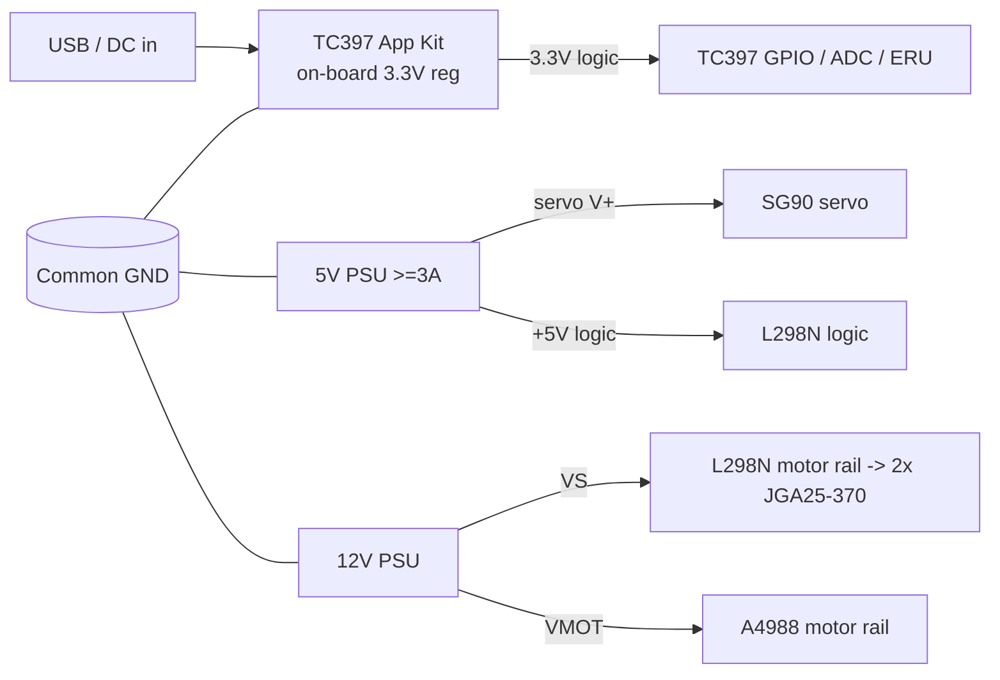

# TC397 · Hardware Design

Detailed hardware design for the TC397 safety node: bill of materials, power architecture, peripheral-to-pin allocation, and per-subsystem wiring. Target board: **Infineon AURIX™ TC397 TFT Application Kit (`KIT_A2G_TC397_5V_TFT`)**.

> **Pin-map caveat.** The port/peripheral assignments below are a deliberate allocation against the TC397 peripheral architecture (which GTM channel, which EVADC group, which ERU line). The *silkscreen header pin numbers* and exact alternate-function index must be cross-checked against the `KIT_A2G_TC397_5V_TFT` pinout in the board User Manual before wiring.

## 1. Subsystem overview

| Subsystem | Devices | TC397 peripheral | Req |
|-----------|---------|------------------|-----|
| Networking | Onboard Ethernet PHY + RJ45, **lwIP** stack | GETH (RGMII) | HNC-SAF-01 |
| Actuator: A/C (2 fans/blower) | 2× JGA25-370 DC 12 V + **L298N** H-bridge | GTM PWM + GPIO | HNC-SAF-03 |
| Actuator: memory seat | Bipolar stepper + A4988 | GTM PWM + GPIO | HNC-SAF-03 |
| Actuator: trunk lock | SG90 servo | GTM PWM (50 Hz) | HNC-SAF-03 |
| Indicator | Common-cathode RGB LED | GTM PWM ×3 | HNC-SAF-03 |
| Sensor: cabin temp + humidity | **DHT11** | GPIO (single-wire timing) | HNC-SAF-04 |
| Sensor: fuel level | 10 kΩ rotary pot | EVADC | HNC-SAF-04 |
| Sensor: seat position | 10 kΩ slide pot | EVADC | HNC-SAF-04 |
| Fault injection | 4 × tactile buttons | SCU-ERU edge IRQ | HNC-SAF-05 |

## 2. Bill of materials (demo-grade)

| # | Part | Qty | Role | Notes |
|---|------|-----|------|-------|
| 1 | **L298N dual H-bridge module** ("common board") | 1 | A/C dual-motor driver | 2 channels: ENA/ENB = PWM speed, IN1–IN4 = direction; 5 V logic (see level note) |
| 2 | **JGA25-370 DC gearmotor, 12 V 170 RPM** | 2 | A/C fans / blower | One per L298N channel |
| 3 | A4988 (or DRV8825) stepper driver | 1 | Seat stepper driver | STEP/DIR logic 3.3 V OK; set Vref for coil current |
| 4 | Bipolar stepper (NEMA17 / 17HS) | 1 | Memory seat | Position by step counting |
| 5 | SG90 micro servo | 1 | Trunk lock | 50 Hz PWM, 5 V power |
| 6 | Common-cathode 5 mm RGB LED | 1 | Status/fault indicator | 3 × series resistor (~220–330 Ω) |
| 7 | **DHT11** temp + humidity sensor | 1 | Cabin temp (+humidity) | Single-wire digital, 1 GPIO, 3.3 V |
| 8 | 4.7 kΩ resistor | 1 | DHT11 DATA pull-up | DATA → 3.3 V |
| 9 | 10 kΩ rotary potentiometer | 1 | Fuel level knob | Wiper → ADC, twistable in demo |
| 10 | 10 kΩ slide potentiometer | 1 | Seat position feedback | Wiper → ADC |
| 11 | Tactile push buttons | 4 | Fault-injection triggers | To GND, internal pull-up |
| 12 | Bench PSU 5 V / ≥3 A | 1 | Servo + L298N +5 V logic | Common GND with board |
| 13 | Bench PSU 12 V (motor-rated) | 1 | L298N VS + A4988 VMOT | Common GND with board |
| 14 | 100 µF + 0.1 µF caps per motor rail | — | Bulk + decoupling | Across VS/VMOT to GND |
| 15 | Breadboard + Dupont jumpers | — | Prototyping | — |

> **Easy to source in Egypt:** items 3–11 + caps are standard local-shop parts. Items 1–2 (L298N + JGA25-370 ×2) and the DHT11 you already have.

## 3. Power architecture



Rules:
- **One common ground** ties the board, the 5 V supply, and the 12 V supply together — mandatory; driver logic references board GND.
- Motors run from their **own 12 V supply** via the L298N/A4988 — the board never sources motor current. The L298N drops ~2 V, so the JGA25-370 see ~10 V (fine for a demo; raise to ~14 V if you want full RPM).
- Each motor rail gets a 100 µF bulk + 0.1 µF decoupling cap near the driver.
- **⚠️ L298N logic level:** the L298N inputs are 5 V TTL. A 3.3 V "high" from the TC397 normally clears its ~2.3 V threshold and works, but this is the **one marginal interface** in the build. If a channel misbehaves, add a 3.3 V→5 V buffer (e.g. a 74AHCT125) or a small level shifter. Everything else (A4988, SG90, DHT11, ADC) is happy at 3.3 V.

## 4. Pin / connection allocation

> "GTM TOMx_y" = GTM Timer Output Module x, channel y (PWM). EVADC groups/channels map to the analog (AN) header.

### 4.1 Actuators

| Signal | Dir | TC397 pin (proposed) | Peripheral / mode | To device pin |
|--------|-----|----------------------|-------------------|---------------|
| AC1_EN (speed) | out | P02.0 | GTM TOM0_0, ~10 kHz PWM | L298N ENA |
| AC1_IN1 | out | P02.1 | GPIO | L298N IN1 |
| AC1_IN2 | out | P00.4 | GPIO | L298N IN2 |
| AC2_EN (speed) | out | P02.6 | GTM TOM0_3, ~10 kHz PWM | L298N ENB |
| AC2_IN3 | out | P00.5 | GPIO | L298N IN3 |
| AC2_IN4 | out | P00.6 | GPIO | L298N IN4 |
| SEAT_STEP | out | P02.2 | GTM TOM0_1, variable-freq | A4988 STEP |
| SEAT_DIR | out | P02.3 | GPIO | A4988 DIR |
| SEAT_EN# | out | P02.4 | GPIO (active-low) | A4988 ENABLE |
| TRUNK_PWM | out | P02.5 | GTM TOM0_2, 50 Hz | SG90 signal |
| LED_R | out | P10.1 | GTM ATOM1_0, ~1 kHz | RGB R (330 Ω) |
| LED_G | out | P10.2 | GTM ATOM1_1, ~1 kHz | RGB G (330 Ω) |
| LED_B | out | P10.3 | GTM ATOM1_2, ~1 kHz | RGB B (220 Ω) |

A/C motors: each L298N channel uses EN (PWM = speed) + IN1/IN2 (direction). Fans only need one direction, so IN pins can sit fixed (IN1=1, IN2=0) and speed comes from the EN PWM — but wiring both lets you reverse if desired. The two motors can run together (one "A/C on" command) or independently.

### 4.2 Sensors

**Analog (EVADC, referenced to 3.3 V / AVDD):**

| Signal | TC397 pin | EVADC channel | Source | Scaling |
|--------|-----------|---------------|--------|---------|
| FUEL_AIN | AN1 | G0 CH1 | 10 kΩ pot wiper | % = V/3.3 × 100 |
| SEAT_AIN | AN2 | G0 CH2 | slide pot wiper | steps = round(V/3.3 × MAX_STEPS) |

Pots: ends to 3.3 V / GND, wiper to AN pin → guaranteed 0–3.3 V, ADC-safe.

**Digital (DHT11, single-wire):**

| Signal | TC397 pin | Mode | Notes |
|--------|-----------|------|-------|
| DHT11_DATA | P00.7 | GPIO in/out, open-drain + 4.7 kΩ pull-up to 3.3 V | Bit-banged single-wire timing; one read/sec; gives temp **and** humidity |

> DHT11 is **not** an ADC sensor — it's a digital single-wire protocol with strict µs-level timing (start pulse, 40-bit response). It needs a GPIO that can switch in→out and a microsecond timer (STM). Sample ≤1 Hz (the sensor's limit). Cabin temp therefore moved off the ADC; fuel + seat stay on the ADC.

### 4.3 Fault-injection buttons (SCU-ERU)

| Signal | TC397 pin | ERU line | Fault code (example) |
|--------|-----------|----------|----------------------|
| BTN_OVERHEAT | P00.0 | ERU REQ0 | P0217 engine overheat |
| BTN_LOWFUEL  | P00.1 | ERU REQ1 | low-fuel warning |
| BTN_DOOR     | P00.2 | ERU REQ2 | door-ajar |
| BTN_CRITICAL | P00.3 | ERU REQ3 | critical → SAFE mode |

Each button: pin → button → GND, internal **pull-up** enabled (idle high, press = falling edge). ERU edge-detect → interrupt; ≥20 ms SW debounce.

### 4.4 Networking (GETH + lwIP)

| Interface | Detail |
|-----------|--------|
| MAC/PHY | TC397 GETH, RGMII to the App-Kit on-board PHY |
| Stack | **lwIP** (NO_SYS / bare-metal raw API), IfxGeth as the netif driver |
| IP | TC397 static, e.g. `192.168.10.30/24`; NXP `192.168.10.10` |
| Telemetry | **UDP** TC→NXP (sensor stream, loss-tolerant) |
| Commands + events | **TCP** (reliable): NXP→TC commands, TC→NXP fault/rejection events |

> Replaces the earlier raw-L2 EtherType scheme — see TC397-Networking and the superseded Decision-Raw-L2. Confirm the PHY part / RMII-vs-RGMII / MDIO address from the board schematic; GETH MAC pins are fixed-function (no manual routing).

## 5. Full connection block diagram

```mermaid
flowchart TB
    subgraph TC397["AURIX TC397 (KIT_A2G_TC397_5V_TFT)"]
        GETH[GETH + lwIP]
        GTM[GTM PWM]
        GPIO[GPIO]
        ADC[EVADC]
        ERU[SCU-ERU]
    end
    GETH <-->|RGMII| PHY[PHY + RJ45] <-->|UDP telem / TCP cmd| NXPNXP Gateway
    GTM -->|ENA/ENB PWM| L298N
    GPIO -->|IN1..IN4| L298N
    L298N -->|12V| ACM[2x JGA25-370 - A/C fans]
    GTM -->|STEP| A4988 --> STEP[Stepper - seat]
    GPIO -->|DIR / EN#| A4988
    GTM -->|50 Hz| SG90[SG90 - trunk]
    GTM -->|R/G/B| RGB[RGB status LED]
    GPIO <-->|1-wire| DHT11[DHT11 temp+humidity]
    FUEL[Fuel pot] -->|AN1| ADC
    SEATP[Seat pot] -->|AN2| ADC
    BTNS[4x fault buttons] -->|edge| ERU
```

## 6. Bring-up order (recommended)

1. **lwIP up** — port the ready Infineon lwIP example, get UDP echo with NXP (HNC-SAF-01).
2. **RGB LED PWM** — GTM sanity check + the indicator you'll reuse everywhere.
3. **EVADC** (fuel, seat) — read the knobs, confirm scaling.
4. **DHT11** — single-wire read (temp + humidity); validate timing with the STM.
5. **A/C via L298N** (2× JGA25-370) — EN PWM + direction; then **stepper**, then **servo**.
6. **ERU buttons** — edge IRQ + debounce.
7. Integrate under TC397-SW-Architecture + TC397-Safety-Matrix gating.

## Related
Safety-TC397-Index · TC397-SW-Architecture · TC397-Networking · TC397-Actuators · TC397-Sensors · TC397-Fault-Injection · Req-Safety
