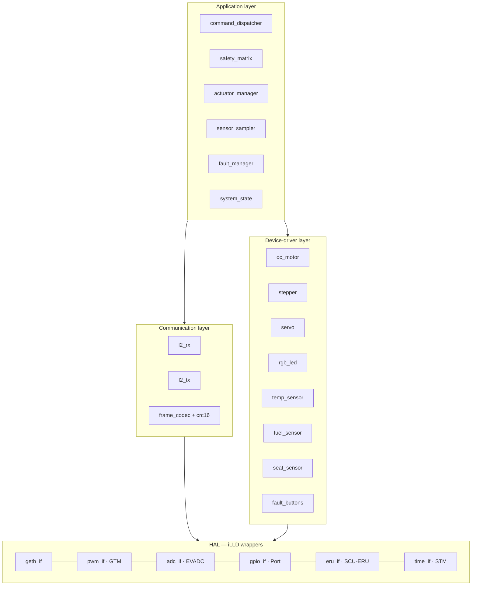
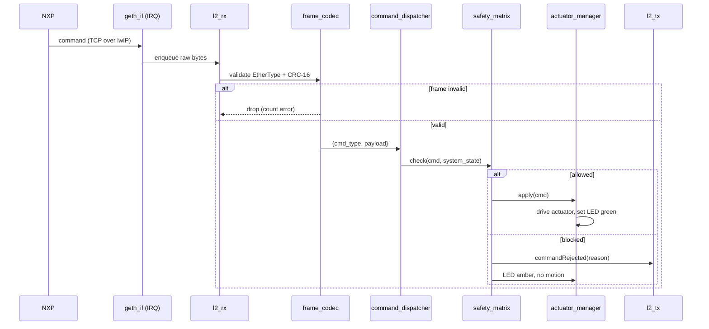
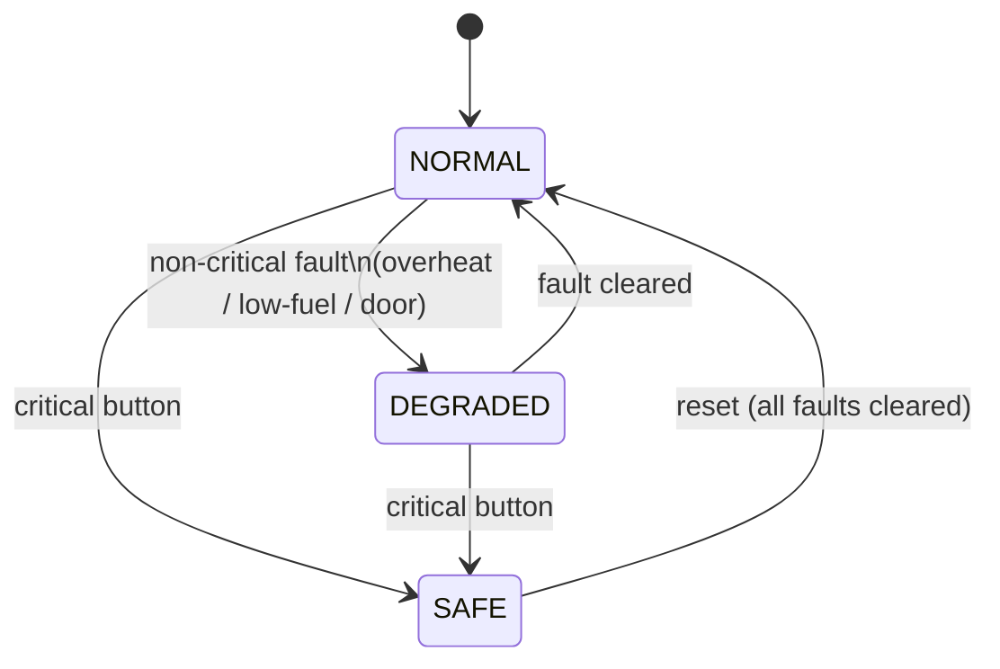

# TC397 · Software Architecture

Firmware architecture for the TC397 safety node. Bare-metal C on **AURIX Development Studio** with **iLLD** drivers — no RTOS. The node receives commands over lwIP (TCP), gates them through the Safety-Matrix, drives actuators, samples sensors, streams telemetry (UDP), and reports faults/rejections (TCP). It **does not trust upstream nodes** (HNC-SAF-07).

## 1. Layered structure



Dependency rule: upper layers call lower layers only. Drivers never call the application. The HAL is the only layer that includes iLLD headers, so a board/driver change is contained to one layer.

## 2. Module responsibilities

| Module | Layer | Responsibility |
|--------|-------|----------------|
| `net_if` (lwIP) | HAL | Init GETH+PHY + lwIP netif (NO_SYS); UDP telemetry TX; TCP command server RX; TCP event TX |
| `pwm_if` | HAL | Configure GTM TOM/ATOM channels; set frequency + duty |
| `adc_if` | HAL | Configure EVADC groups/channels; trigger + read results |
| `gpio_if` | HAL | Digital in/out, pull config |
| `eru_if` | HAL | Map button pins to ERU lines, enable edge IRQ |
| `time_if` | HAL | STM-based `now_us()` + periodic 1 ms tick |
| `frame_codec` | Comm | Encode/decode CMD_TYPE + payload; CRC-16 verify/append |
| `l2_rx` | Comm | Pull frames from ring buffer, filter EtherType `0x88B5`, hand validated commands up |
| `l2_tx` | Comm | Build + send `sensorData` / `faultEvent` / `commandRejected` |
| `dc_motor` | Driver | Heater on/off + speed via PWM + DIR |
| `stepper` | Driver | Absolute seat position by step counting (STEP/DIR/EN) |
| `servo` | Driver | Trunk angle via 50 Hz pulse width |
| `rgb_led` | Driver | Status colour (e.g. green=ok, amber=blocked, red=fault) |
| `temp_sensor` / `fuel_sensor` / `seat_sensor` | Driver | Read ADC + scale to °C / % / steps |
| `fault_buttons` | Driver | ERU callback → debounce → fault code |
| `command_dispatcher` | App | Route a decoded command to the right handler |
| `safety_matrix` | App | Gate every command against speed + fault state |
| `actuator_manager` | App | Apply allowed commands, track actuator state |
| `sensor_sampler` | App | Periodically refresh the latest sensor snapshot |
| `fault_manager` | App | Hold active fault set; drive state transitions |
| `system_state` | App | NORMAL / DEGRADED / SAFE + cached vehicle speed |

## 3. Scheduling model (super-loop + STM tick)

No RTOS. A 1 ms tick from the STM compare interrupt sets soft flags; the main loop services them. IRQ-driven work (GETH RX, ERU buttons) is handled at interrupt level with minimal processing, then deferred to the loop.

| Task | Rate | Trigger | Core |
|------|------|---------|------|
| Command RX (TCP) decode + dispatch | event | lwIP RX → loop | CPU0 |
| Telemetry TX (UDP) | 20–50 Hz | tick | CPU0 |
| Sensor sample + scale | 50 Hz (20 ms) | tick flag | CPU0 |
| Actuator update (stepper ramps, servo hold) | 1 kHz (1 ms) | tick | CPU0 |
| LED state update | 10 Hz | tick | CPU0 |
| Fault button handling | event | ERU IRQ → loop | CPU0 |
| TX sensorData | on request | `requestSensors` cmd | CPU0 |
| TX faultEvent | event | fault set change | CPU0 |

> **Core usage (minimal).** Everything runs on **CPU0** for the first bring-up; the remaining cores are spare. The stepper's time-critical STEP pulses come from GTM hardware (not CPU bit-banging), so a single core is sufficient. If timing margins tighten later, move `geth_if` RX + `l2` to CPU1.

## 4. Command pipeline (RX → action)



CMD_TYPE handling follows Raw-L2-Frame-Format: `0x01` setHeater, `0x02` setSeat, `0x03` setTrunk, `0x04` setAmbientLED, `0x10` requestSensors. Replies: `0x80` sensorData, `0x81` faultEvent, `0x82` commandRejected.

## 5. Safety gating logic (the core of the node)

`safety_matrix.check()` is a pure function of the command and the cached system state — no side effects, easy to unit-test. Authoritative rules live in Safety-Matrix.

```c
typedef enum { ALLOW, BLOCK } gate_t;

gate_t safety_check(const command_t *c, const system_state_t *s) {
    if (s->mode == SAFE) return BLOCK;            // critical fault: block all
    switch (c->type) {
        case CMD_SET_SEAT:
            return (s->speed_kmh > 10) ? BLOCK : ALLOW;   // occupant safety
        case CMD_SET_TRUNK:
            return (s->speed_kmh > 0)  ? BLOCK : ALLOW;   // security
        case CMD_SET_HEATER:
            return fault_active(s, FAULT_OVERHEAT) ? BLOCK : ALLOW;
        default:
            return ALLOW;                          // LEDs, sensor requests
    }
}
```

On `BLOCK`: no actuator moves, `commandRejected(reason)` is sent to NXP (→ RPi5 explains to the driver in natural language), and the RGB LED goes amber. This is the physical guarantee behind HNC-SYS-05.

## 6. Fault-injection & state machine



- An **ERU edge IRQ** sets a pending fault; the loop debounces (≥20 ms), updates `fault_manager`, sends `faultEvent (0x81)`, and refreshes the gate (e.g. overheat now blocks the heater).
- **DEGRADED** still allows unrelated actuators; only the affected action is gated.
- **SAFE** blocks every command and holds the RGB LED red until reset.

## 7. Frame codec & integrity

- Layout per Raw-L2-Frame-Format: `[CMD_TYPE 1B][PAYLOAD NB][CRC 2B]` inside the L2 payload.
- **CRC-16/CCITT** over `CMD_TYPE + PAYLOAD`; mismatched frames are dropped and counted (diagnostic counter, surfaced in a future `faultEvent`).
- Payload byte layouts are fixed per CMD_TYPE (to be finalised in `hnc-docs`); the codec exposes typed pack/unpack helpers so the application never touches raw bytes.

## 8. Error handling & defensive posture

- Every inbound frame is validated (EtherType, length, CRC) before use — untrusted input (HNC-SAF-07).
- ADC reads are range-checked; out-of-range → last-good value + flagged.
- Unknown CMD_TYPE → ignored + error counter (no crash, no default action).
- Actuator commands are clamped to safe physical limits (servo angle, stepper end-stops, PWM duty).

## 9. Toolchain & build

- **AURIX Development Studio** (Eclipse-based), iLLD bare-metal C, on-board miniWiggler debug.
- One project; modules as separate `.c/.h` per the layering above.
- `safety_matrix` and `frame_codec` are written host-portable (no iLLD includes) so they can be unit-tested off-target.

## Related
Safety-TC397-Index · TC397-HW-Design · TC397-Safety-Matrix · TC397-Networking · Raw-L2-Frame-Format · Safety-Matrix · Req-Safety
